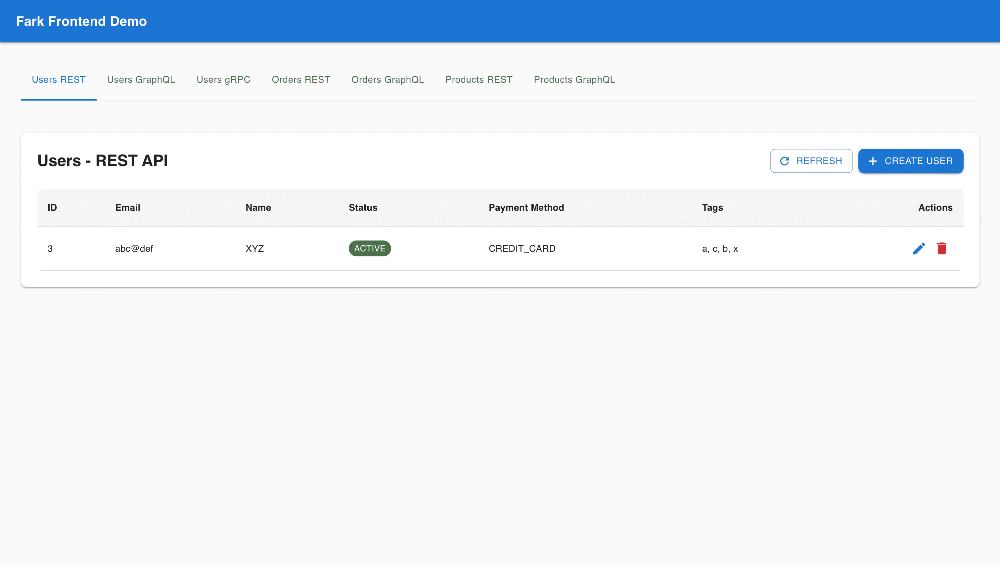

# Fark Frontend Demo

Frontend application that uses REST, GraphQL, and gRPC APIs from the backend. Built for testing Fark.ai's frontend impact detection.



## Tech Stack

- **React 19** with TypeScript
- **Vite** for build tooling
- **Material-UI (MUI)** for UI components
- **Apollo Client** for GraphQL
- **Fetch API** for REST
- **gRPC** (mock implementation - browser limitation)

## Project Structure

```
src/
├── api/
│   ├── rest.ts          # REST API client
│   ├── graphql.ts       # GraphQL client & queries
│   └── grpc.ts          # gRPC client (mock)
├── components/
│   ├── RestUserComponent.tsx         # Users via REST API
│   ├── GraphQLUserComponent.tsx     # Users via GraphQL
│   ├── GrpcUserComponent.tsx         # Users via gRPC (mock)
│   ├── RestProductsComponent.tsx     # Products via REST API
│   ├── GraphQLProductsComponent.tsx  # Products via GraphQL
│   ├── RestOrdersComponent.tsx       # Orders via REST API
│   └── GraphQLOrdersComponent.tsx    # Orders via GraphQL
├── contexts/
│   └── RefreshContext.tsx            # Global refresh context
├── types/
│   └── models.ts        # Shared TypeScript types
├── App.tsx              # Main app component with tabbed interface
└── main.tsx             # Entry point
```

## Setup

```bash
npm install
npm run dev
```

The app will run on `http://localhost:5173`

## UI Overview

The application features a tabbed interface with 7 tabs:

- **Users REST** - User management via REST API
- **Users GraphQL** - User management via GraphQL
- **Users gRPC** - User management via gRPC (mock)
- **Orders REST** - Order management via REST API
- **Orders GraphQL** - Order management via GraphQL
- **Products REST** - Product management via REST API
- **Products GraphQL** - Product management via GraphQL

## API Usage

### REST API

- **Client**: `src/api/rest.ts`
- **Components**: `RestUserComponent`, `RestProductsComponent`, `RestOrdersComponent`
- **Endpoints**:
  - `/api/users` (GET, POST, PUT, DELETE)
  - `/api/products` (GET, POST, PUT, DELETE)
  - `/api/orders` (GET, POST, PUT, DELETE)

### GraphQL API

- **Client**: `src/api/graphql.ts` (Apollo Client)
- **Components**: `GraphQLUserComponent`, `GraphQLProductsComponent`, `GraphQLOrdersComponent`
- **Endpoint**: `/graphql`
- **Queries**:
  - `GET_USER`, `GET_USERS` (users without paymentMethod field)
  - `GET_PRODUCTS`
  - `GET_ORDER`, `GET_ORDERS`
- **Mutations**:
  - `CREATE_USER`, `UPDATE_USER`, `DELETE_USER`
  - `CREATE_PRODUCT`, `UPDATE_PRODUCT`, `DELETE_PRODUCT`
  - `CREATE_ORDER`, `UPDATE_ORDER`, `DELETE_ORDER`

### gRPC API

- **Client**: `src/api/grpc.ts` (mock - browser limitation)
- **Component**: `GrpcUserComponent`
- **Note**: gRPC doesn't work directly in browsers. This is a mock implementation that references API fields for Fark.ai testing.

## Features

The frontend uses all three API interfaces and references:

- **User fields**: `id`, `email`, `name`, `status`, `description`, `metadata`, `tags`
  - Note: `paymentMethod` is not queried in `GET_USERS` but is still used in mutations
- **Order fields**: `id`, `userId`, `productIds`, `status`, `total`, `discountCode`, `shippingAddress`
- **Product fields**: `id`, `name`, `price`, `category`, `inStock`, `specifications`
- **Enums**: `UserStatus` (ACTIVE, INACTIVE, PENDING), `OrderStatus` (CREATED, PROCESSING, SHIPPED, DELIVERED)
- **Types**: `PaymentMethod` (union type in GraphQL schema, but not queried in list views)

## Testing with Fark.ai

When the backend introduces breaking changes (field renames, enum changes, etc.), Fark.ai's frontend impact finder will:

1. Search this codebase for references to changed API fields
2. Identify impacted files and line numbers
3. Determine severity and suggest fixes

## Development

```bash
# Type checking
npm run typecheck

# Build
npm run build

# Preview production build
npm run preview
```

## Notes

- The backend must be running on `localhost:3000` (REST/GraphQL) and `localhost:50051` (gRPC)
- gRPC client is mocked due to browser limitations - it still references API fields for testing
- All components use the shared types from `src/types/models.ts` which match the backend
- Material-UI is used for all UI components, providing a consistent and modern interface
- The app uses a tabbed interface to switch between different API implementations for the same resources
